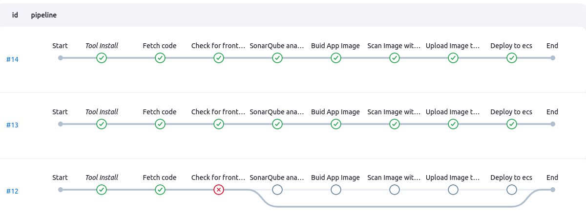

# LAMP Stack Deployment with Reverse Proxy & Monitoring

This project sets up a **React frontend**, **PHP backend (Apache on port 5000)**, **MySQL database**, and **NGINX as a reverse proxy** for handling requests. The entire application is **Dockerized**, and logs are sent to **AWS CloudWatch**, with **CloudWatch Agent** monitoring memory usage and disk.

## **Project Structure**

```
.
├── frontend/       # React App (Served by NGINX on port 80)
├── api/            # PHP App (Apache listening on port 5000)
├── db/             # MySQL Database in Docker on port 3306       
├── docker-compose.yml
└── README.md
```

## **AWS EC2 Deployment Steps**

### **1. Launch an EC2 Instance**
- Use **Ubuntu 20.04+**.
- Choose an instance type (`t2.micro` for testing, `t3.medium` or higher for production).
- Allow inbound rules for **HTTP (80)**, and **SSH (22)** and **Custom TCP (5000)**.

### **2. Create IAM Role And Attach it to the Instance**
add the following permissions to the IAM ROLE
- `CloudWatchFullAccess` permissions policy.
- `AmazonSSMManagedInstanceCore` permissions policy.
- `CloudWatchAgentServerPolicy` permissions policy.
- `AmazonEC2FullAccess` permissions policy.

### **3. Creation of Cloudwatch Log-group and log-stream**
- Log Group Name **docker-logs**
- log-stream Name **app-logs**
- log-stream Name **web-logs**
- log-stream Name **mysql-logs**



### **4. Configure CloudWatch agent to collect memory usage and disk metrics**
- Select your instance,Monitoring tab and click Configure CloudWatch agent

- Select Memory and Disk 


### **5. Connect to the Instance**

```sh
    ssh -i your-key.pem ubuntu@your-ec2-public-ip
```
## Install Required Packages
```sh
    for pkg in docker.io docker-doc docker-compose docker-compose-v2 podman-docker containerd runc; do sudo apt-get remove $pkg; done
    # Add Docker's official GPG key:
    sudo apt-get update
    sudo apt-get install ca-certificates curl
    sudo install -m 0755 -d /etc/apt/keyrings
    sudo curl -fsSL https://download.docker.com/linux/ubuntu/gpg -o /etc/apt/keyrings/docker.asc
    sudo chmod a+r /etc/apt/keyrings/docker.asc

    # Add the repository to Apt sources:
    echo \
    "deb [arch=$(dpkg --print-architecture) signed-by=/etc/apt/keyrings/docker.asc] https://download.docker.com/linux/ubuntu \
    $(. /etc/os-release && echo "${UBUNTU_CODENAME:-$VERSION_CODENAME}") stable" | \
    sudo tee /etc/apt/sources.list.d/docker.list > /dev/null
```
## Install Docker and Docker Compose
```sh
    sudo apt-get update
    sudo apt-get install docker-ce docker-ce-cli containerd.io docker-buildx-plugin docker-compose-plugin
    sudo apt-get install docker-compose
```

## Clone the Repository
```sh
    git clone https://github.com/BINAH25/react-crud-php-api-mysql.git
    cd eact-crud-php-api-mysql
```
## **Reverse Proxy Configuration (NGINX)**
```sh
    vim frontend/nginx.conf
```

```nginx
    server {
        listen 80;
        server_name 127.0.0.1; # replace 127.0.0.1 with your ip

        location / {
            root /usr/share/nginx/html;
            index index.html;
            try_files $uri /index.html;
        }

        location /api/ {
            proxy_pass http://127.0.0.1:5000
            proxy_set_header Host $host;
            proxy_set_header X-Real-IP $remote_addr;
            proxy_set_header X-Forwarded-For $proxy_add_x_forwarded_for;
        }
    }
```

### **Build & Run Docker Containers**
```sh
    docker-compose up --build -d
```


## **Monitoring & Logging**
- Logs from React, Apache, and MySQL are sent to AWS CloudWatch.

- AWS CloudWatch Agent is installed to collect **memory usage and disk metrics**.


## **Security & Performance Enhancements**
- **SSL/TLS** can be enabled using Let's Encrypt.
- **Load Balancing** can be added using AWS ALB or NGINX upstream.
- **Rate Limiting** can be configured in NGINX.
- **Database Backups** should be configured for MySQL.

---

## **Stopping & Removing Containers**
```sh
docker-compose down
```

Happy Coding! 🚀
